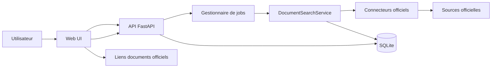

# Architecture cible - Webapp de recherche de documents financiers

## Objectif

Construire une webapp permettant de rechercher des documents financiers publiés sur les places boursières et mécanismes officiels déjà couverts par InfoFin, puis d'afficher des liens vers les documents officiels. L'utilisateur choisit ensuite librement d'ouvrir ou télécharger les documents depuis leur source d'origine.

Le périmètre cible est volontairement différent du mode historique de veille: la webapp ne doit pas télécharger les fichiers par défaut. Elle doit lancer une recherche, agréger les résultats, permettre des filtres ergonomiques, puis exposer des liens fiables, traçables et exportables.

## Analyse du projet existant

Le projet est aujourd'hui un collecteur Python en ligne de commande.

Points réutilisables directement:

- `connectors/base.py` définit le contrat commun `Connector` et le modèle `DocumentCandidate`.
- La majorité des connecteurs implémentent déjà `supports_source_first = True` et `search_recent_documents(...)`, ce qui permet une recherche par place et par période sans watchlist.
- `main.py` contient déjà le cas d'usage proche du besoin avec `discover_market_document_links(...)` et la commande `discover-market-documents`.
- `classification.py` fournit une classification déterministe des documents: rapport annuel, rapport semestriel, rapport trimestriel, DEU/URD, ESEF, etc.
- `load_watchlist.py` centralise la normalisation des noms de marchés.
- `config.py` et `.env.example` exposent les URLs officielles, timeouts, retries, rate limits et lookbacks par source.
- `db.py` contient un schéma SQLite robuste pour la veille et peut être étendu pour stocker les recherches web et leurs résultats.
- `tests/test_market_document_links.py` couvre déjà le filtrage par date, la déduplication, les erreurs par marché et l'export JSON/CSV.

Limites actuelles pour une webapp:

- `discover_market_document_links(...)` écrit directement un fichier CSV/JSON. Pour une API, il faut extraire un service pur qui retourne un objet de résultats avant l'écriture éventuelle.
- Les filtres métier sont limités à la période, aux marchés et à la déduplication d'URL. Il faut ajouter les filtres par type de document, texte, émetteur, ISIN, source, format et confiance de date.
- Une recherche multi-marchés peut durer plusieurs secondes ou minutes selon la période et les sources. Elle doit donc être exécutée comme un job asynchrone avec progression.
- Le schéma `documents` actuel est orienté fichiers téléchargés. Il faut un stockage séparé pour les résultats de recherche de liens, afin de ne pas mélanger "document trouvé" et "document téléchargé".

## Principes cible

- Source officielle d'abord: réutiliser les connecteurs existants et leurs règles de respect des sources.
- Aucun téléchargement serveur par défaut: la webapp affiche des liens officiels et ne stocke pas les fichiers.
- Recherche asynchrone: l'API crée un job, la webapp affiche la progression, puis les résultats.
- Filtres reproductibles: toute recherche doit être rejouable à partir des paramètres stockés.
- Architecture incrémentale: commencer avec FastAPI, SQLite et un worker local; pouvoir évoluer vers Redis/RQ ou Celery si l'usage devient multi-utilisateur.
- Compatibilité CLI: la commande `discover-market-documents` doit continuer à fonctionner en déléguant au même service applicatif que la webapp.

## Architecture fonctionnelle



## Stack recommandée

### Backend

- Python 3.12, pour rester aligné avec le projet.
- FastAPI pour exposer une API typée et simple à tester.
- Pydantic pour valider les payloads de recherche.
- SQLite en MVP, avec WAL déjà utilisé par `db.py`.
- `ThreadPoolExecutor` ou `asyncio.to_thread` pour les jobs locaux, car les connecteurs sont actuellement synchrones et basés sur `requests`.
- Uvicorn pour le serveur de développement et de production légère.

### Frontend

MVP recommandé: templates Jinja2 + HTMX + CSS simple.

Raison: le besoin principal est une interface de recherche, un tableau filtrable, des exports et du polling de job. Une SPA React n'est pas nécessaire au départ et ajouterait une chaîne de build indépendante.

Option ultérieure: React/Vite peut consommer la même API si l'interface devient plus complexe.

## Modules cible

Structure proposée:

```text
webapp/
  __init__.py
  app.py                    # création FastAPI, routes HTML et API
  schemas.py                # modèles Pydantic d'entrée/sortie
  auth.py                   # optionnel: auth simple si déploiement distant
  jobs.py                   # JobManager local, annulation, progression
  repositories.py           # accès SQLite pour searches/results
  services/
    document_search.py      # orchestration métier réutilisée par CLI et API
    filters.py              # filtres de type, texte, format, émetteur
    exports.py              # CSV/JSON des résultats de recherche
  templates/
    layout.html
    search.html
    results.html
    partials/
      job_status.html
      results_table.html
  static/
    app.css
    app.js                  # uniquement comportements UI non couverts par HTMX
```

Refactor côté CLI:

```text
main.py
  discover_market_document_links(...)
    -> appelle DocumentSearchService.search_links(...)
    -> écrit CSV/JSON pour compatibilité CLI
```

## Modèle de données cible

Ajouter des tables dédiées à la recherche web, sans modifier la signification de `documents`.

### `web_search_jobs`

```sql
CREATE TABLE web_search_jobs (
    id TEXT PRIMARY KEY,
    created_at TEXT NOT NULL,
    started_at TEXT,
    finished_at TEXT,
    status TEXT NOT NULL,              -- queued, running, done, partial, failed, cancelled
    request_json TEXT NOT NULL,
    markets_count INTEGER NOT NULL,
    results_count INTEGER NOT NULL DEFAULT 0,
    warnings_json TEXT NOT NULL DEFAULT '[]',
    errors_json TEXT NOT NULL DEFAULT '[]'
);
```

### `web_search_market_runs`

```sql
CREATE TABLE web_search_market_runs (
    id INTEGER PRIMARY KEY,
    job_id TEXT NOT NULL REFERENCES web_search_jobs(id) ON DELETE CASCADE,
    market TEXT NOT NULL,
    source TEXT,
    status TEXT NOT NULL,              -- queued, running, ok, error, skipped
    candidates_returned INTEGER NOT NULL DEFAULT 0,
    results_count INTEGER NOT NULL DEFAULT 0,
    warning TEXT,
    error TEXT,
    started_at TEXT,
    finished_at TEXT
);
```

### `web_search_results`

```sql
CREATE TABLE web_search_results (
    id INTEGER PRIMARY KEY,
    job_id TEXT NOT NULL REFERENCES web_search_jobs(id) ON DELETE CASCADE,
    market TEXT NOT NULL,
    source TEXT NOT NULL,
    source_document_id TEXT,
    published_at TEXT,
    period_end_date TEXT,
    reporting_year INTEGER,
    document_type TEXT NOT NULL,
    classification TEXT,
    title TEXT NOT NULL,
    url TEXT NOT NULL,
    issuer_name TEXT,
    issuer_isin TEXT,
    issuer_lei TEXT,
    category TEXT,
    file_format TEXT,
    date_confidence TEXT,
    source_publication_date_raw TEXT,
    metadata_json TEXT NOT NULL DEFAULT '{}',
    created_at TEXT NOT NULL
);

CREATE INDEX idx_web_search_results_job ON web_search_results(job_id);
CREATE INDEX idx_web_search_results_type ON web_search_results(document_type);
CREATE INDEX idx_web_search_results_market ON web_search_results(market);
CREATE INDEX idx_web_search_results_url ON web_search_results(url);
```

## Contrat API cible

### Référentiels

- `GET /api/markets`
  - Retourne `SUPPORTED_WATCH_MARKETS`, les aliases utiles et l'état du connecteur si connu.
- `GET /api/document-types`
  - Retourne les types normalisés et leurs libellés français.
- `GET /api/sources/health`
  - Retourne les derniers diagnostics disponibles et les sources en erreur.

### Recherche

- `POST /api/searches`
  - Crée un job de recherche.
  - Payload:

```json
{
  "markets": ["Euronext Paris", "Oslo Børs"],
  "date_from": "2026-01-01",
  "date_to": "2026-06-30",
  "document_types": ["annual_financial_report", "half_year_financial_report"],
  "query": "totalenergies",
  "issuer_isin": null,
  "dedupe_url": true,
  "max_candidates": 100000
}
```

- `GET /api/searches/{job_id}`
  - Retourne statut, progression par marché, erreurs et avertissements.
- `GET /api/searches/{job_id}/results`
  - Résultats paginés et filtrables.
  - Paramètres: `document_type`, `market`, `source`, `q`, `issuer_isin`, `date_from`, `date_to`, `sort`, `page`, `page_size`.
- `GET /api/searches/{job_id}/export?format=csv|json`
  - Export des résultats filtrés ou complets.
- `POST /api/searches/{job_id}/cancel`
  - Annulation best-effort si le job n'est pas terminé.

## Types de documents exposés dans l'UI

Types normalisés actuels:

| Valeur technique | Libellé UI |
|---|---|
| `annual_financial_report` | Rapport annuel |
| `half_year_financial_report` | Rapport semestriel |
| `quarterly_financial_report` | Rapport trimestriel |
| `universal_registration_document` | Document d'enregistrement universel |
| `financial_report` | Rapport financier |
| `esef` | Package ESEF / XHTML / ZIP |

Les connecteurs peuvent aussi remonter des catégories source spécifiques. Elles doivent être affichées en colonne `Catégorie source`, mais le filtre principal doit rester basé sur `document_type`.

## Parcours utilisateur cible

1. L'utilisateur ouvre la page de recherche.
2. Il choisit une ou plusieurs places boursières.
3. Il sélectionne une période ou un preset: 7 jours, 30 jours, année en cours, exercice précédent.
4. Il filtre éventuellement par type de document, texte libre, ISIN, émetteur, format ou source.
5. Il lance la recherche.
6. La page affiche la progression par marché: en attente, en cours, terminé, erreur.
7. Les résultats apparaissent dans un tableau triable.
8. Chaque ligne propose:
   - ouvrir le document officiel;
   - copier le lien;
   - ouvrir la page source si disponible dans les métadonnées;
   - afficher les métadonnées détaillées.
9. L'utilisateur peut exporter les résultats en CSV ou JSON.

## Filtres utiles

Filtres MVP:

- Marchés.
- Date de publication.
- Type de document.
- Texte libre sur titre, émetteur, ISIN, LEI, catégorie.
- Déduplication globale par URL.
- Source.
- Confiance de date.

Filtres post-MVP:

- Format détecté: PDF, XHTML, XML, ZIP, XBRI.
- Exercice comptable (`reporting_year`).
- Date de clôture (`period_end_date`).
- Présence d'un ISIN ou d'un LEI.
- Masquer les résultats sans lien direct.
- Regrouper par émetteur ou par document source.

## Comportement des recherches

Le service cible `DocumentSearchService.search_links(...)` doit:

1. Valider et normaliser les marchés avec `normalize_market(...)`.
2. Refuser les périodes invalides et appliquer une limite configurable.
3. Construire les connecteurs via `connector_for_market(...)`.
4. Vérifier `supports_source_first`.
5. Appeler `search_recent_documents(market, since=date_from, limit=max_candidates)`.
6. Filtrer localement `published_at` / `published_date` entre `date_from` et `date_to`.
7. Dédupliquer par `(source, source_document_id || url)`.
8. Appliquer les filtres métier demandés.
9. Optionnellement dédupliquer globalement par URL.
10. Persister les résultats et les erreurs par marché.

Le service ne doit pas appeler `DocumentDownloader` dans le flux standard.

## UI cible

Écran principal:

- Bandeau de recherche compact avec marchés, période, types de documents et bouton de lancement.
- Tableau de résultats dense, paginé et triable.
- Barre de filtres secondaire pour texte libre, source, format et confiance.
- Badges sobres pour type de document, source et confiance de date.
- Colonne actions avec icônes: ouvrir, copier, détails, export ligne si nécessaire.

Colonnes recommandées:

- Date de publication.
- Marché.
- Émetteur.
- ISIN.
- Type.
- Titre.
- Source.
- Catégorie source.
- Format.
- Confiance date.
- Actions.

## Gestion de la progression

Le `JobManager` maintient une progression par marché:

- `queued`: marché en attente.
- `running`: connecteur en cours.
- `ok`: résultats collectés.
- `error`: connecteur en erreur.
- `skipped`: connecteur absent ou source-first non supporté.

Un job global est:

- `done` si tous les marchés sont terminés sans erreur.
- `partial` si au moins un marché est en erreur mais des résultats existent.
- `failed` si aucun marché n'a pu produire de résultat et qu'une erreur bloquante est survenue.

## Exports

L'export web doit conserver les champs déjà produits par `discover_market_document_links(...)`:

- `market`
- `source`
- `source_document_id`
- `published_at`
- `period_end_date`
- `reporting_year`
- `document_type`
- `classification`
- `title`
- `url`
- `issuer_name`
- `issuer_isin`
- `issuer_lei`
- `category`
- `date_confidence`
- `source_publication_date_raw`

Ajouts recommandés:

- `file_format`
- `job_id`
- `created_at`

## Sécurité et robustesse

- N'autoriser que les URLs `http` et `https` dans les résultats affichés.
- Échapper systématiquement les titres, émetteurs et catégories dans les templates.
- Ouvrir les liens externes avec `target="_blank"` et `rel="noopener noreferrer"`.
- Ne pas proxyfier les téléchargements par défaut, afin d'éviter stockage, bande passante et responsabilité inutile.
- Appliquer les rate limits existants des connecteurs.
- Ajouter une limite de période et de candidats par recherche pour protéger les sources officielles.
- Journaliser les erreurs par source sans interrompre les autres marchés.
- Prévoir une authentification simple si la webapp est exposée hors machine locale.

## Plan de réalisation recommandé

### Phase 1 - Refactor service

- Extraire la logique de `discover_market_document_links(...)` dans `webapp/services/document_search.py`.
- Retourner un objet métier `SearchResultSet` au lieu d'écrire directement un fichier.
- Adapter la CLI pour écrire CSV/JSON à partir de cet objet.
- Ajouter des tests unitaires pour filtres par type, texte libre et format.

### Phase 2 - API et persistance

- Ajouter FastAPI, Pydantic, Jinja2 et Uvicorn aux dépendances.
- Créer les tables `web_search_*`.
- Implémenter `POST /api/searches`, `GET /api/searches/{id}` et `GET /api/searches/{id}/results`.
- Implémenter le `JobManager` local avec un nombre de workers configurable.

### Phase 3 - Interface web

- Créer la page de recherche.
- Ajouter le polling de statut par marché.
- Ajouter le tableau de résultats paginé.
- Ajouter filtres, tri, copie de lien et export CSV/JSON.

### Phase 4 - Exploitation

- Ajouter une commande `serve` ou un module `python -m webapp`.
- Documenter les variables d'environnement web: host, port, workers, limites de période, auth.
- Ajouter un healthcheck applicatif.
- Prévoir une stratégie de purge des anciens jobs et résultats.

## Commandes cibles

Développement local:

```powershell
python -m uvicorn webapp.app:create_app --factory --reload --host 127.0.0.1 --port 8000
```

Commande projet optionnelle:

```powershell
python main.py serve --host 127.0.0.1 --port 8000
```

Recherche CLI conservée:

```powershell
python main.py discover-market-documents --market "Euronext Paris" --date-from 2026-01-01 --date-to 2026-06-30 --format csv
```

## Critères d'acceptation MVP

- Un utilisateur peut lancer une recherche sur un ou plusieurs marchés.
- Les résultats s'affichent sans télécharger les fichiers.
- Les liens ouvrent les documents ou pages officielles.
- Les résultats sont filtrables par type de document.
- Les résultats sont filtrables par date, marché, texte libre et source.
- La progression et les erreurs par marché sont visibles.
- Les résultats peuvent être exportés en CSV et JSON.
- La CLI existante `discover-market-documents` continue de fonctionner.
- Les tests existants restent verts et couvrent le service partagé.
